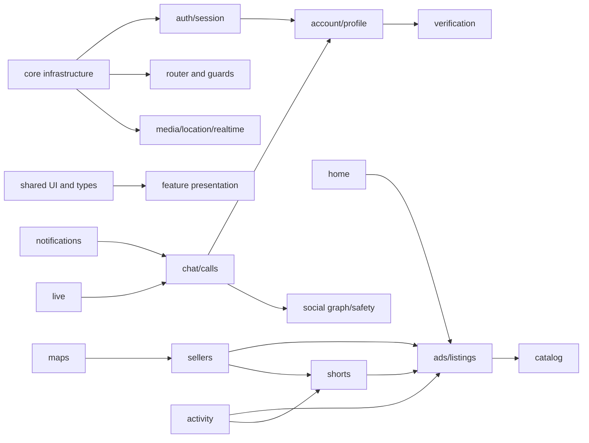

# Dependency Map

## Shared dependency direction

All major features depend heavily on `lib/core`; many marketplace and presentation features also depend on `lib/shared`. The router and root lifecycle create deliberate reverse edges from core/root code into feature route modules and listeners.

## High-value feature edges observed from package imports

| Source | Significant dependencies | Maintenance implication |
| --- | --- | --- |
| Home | Ads, Shorts, Connect, Catalog, Reviews, Sellers | Home regressions often originate in upstream feature models/providers |
| Shorts | Ads, Live, Notifications, Social, Sellers | Requires broad fixture reuse and media lifecycle isolation |
| Connect | Account, Social, Sellers, Ads, Auth, Maps | Chat/call tests must avoid loading unrelated platform listeners |
| Sellers | Shorts, Ads, Connect, Maps, Verification, Live | Seller state changes can affect multiple public and owner surfaces |
| Account | Verification, Auth, Preferences, Ads, Sellers | Session and identity correctness is a prerequisite |
| Ads | Catalog, Home, Preferences, Sellers, Search | Listing tests need catalog/schema and market context fixtures |
| Notifications | Connect and Live | Payload routing and provider invalidation are cross-feature concerns |
| Activity | Ads, Live, Shorts, Social | Activity models aggregate several content types |

## Recommended delivery order

1. Authentication and session
2. Account and profile
3. Ads and listings
4. Seller and verification
5. Shorts
6. Chat
7. Notifications
8. Live and calls
9. Maps and location
10. Search and activity
11. Remaining shared/core regression work

Authentication should be processed first because route guards, API cookies, secure session restoration, realtime startup, user-specific caches, and most protected feature tests depend on a deterministic auth seam.
