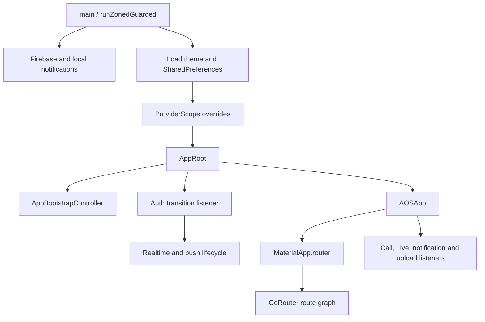

# System Overview

## Runtime composition

The application starts in `lib/main.dart` inside `runZonedGuarded`. Startup performs Flutter binding initialization, global Flutter error configuration, Firebase initialization, Firebase Messaging background registration, local notification initialization, Android notification-channel creation, theme restoration, and `SharedPreferences` acquisition.

The root `ProviderScope` injects the two dependencies that deliberately throw until bootstrap provides them:

- `themeModeProvider` receives a `ThemeController` initialized from `ThemePrefs`;
- `onboardingStorageProvider` receives an `OnboardingStorage` backed by the startup `SharedPreferences` instance.

`AppRoot` starts `AppBootstrapController.initialize()` once and listens to authentication changes. An authenticated transition connects realtime and initializes notifications; a guest transition disconnects realtime and resets push-notification state.

`AOSApp` builds `MaterialApp.router`, watches the global router, theme, preferences, call listener, notification realtime listener, and global Shorts upload listener. Its builder adds call, Live, CallKit, active-call overlay, and in-app notification listeners around routed content.

## Major subsystems

| Area | Primary implementation locations | Responsibility |
| --- | --- | --- |
| Bootstrap | `lib/app/bootstrap`, `lib/main.dart` | Startup readiness and onboarding decision |
| Core | `lib/core` | API, routing, storage, theme, device, location, media, realtime, utilities |
| Shared UI/domain | `lib/shared` | Cross-feature widgets, components, enums, user types, utility code |
| Marketplace | `features/ads`, `catalog`, `home`, `wishlist`, `reviews`, `sellers` | Discovery, listing creation, seller surfaces, reviews and saved items |
| Identity | `features/auth`, `account`, `verifications`, `preferences` | Session, profile, account lifecycle, verification and preferences |
| Social and communication | `features/social`, `connect`, `notifications` | Profiles, follows, safety, conversations, chats, calls and push/realtime updates |
| Video | `features/shorts`, `live` | Short video feeds/creation and LiveKit-backed live sessions |
| Location and discovery | `features/maps`, `search`, `activity` | Maps, place/route services, multimodal search and activity history |

## Architectural characteristics

- Feature folders are the dominant organization, but layer depth varies by feature.
- Riverpod is the dependency injection and reactive state mechanism.
- GoRouter composes centralized and feature-owned route modules.
- Dio is the HTTP transport; the frontend expects Frappe-style response envelopes.
- Shared services are frequently injected through providers, while some platform services remain static or directly constructed.
- Realtime, push, CallKit, and LiveKit have lifecycle side effects at or near the application root.
