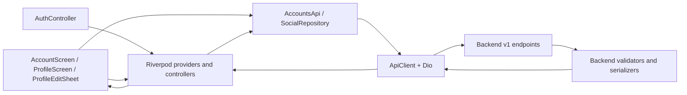

# Architecture

## Layer map

## Presentation

- `AccountScreen` combines `authControllerProvider`, `accountsControllerProvider`, user-verification status, and seller-verification status. It renders either a guest header or authenticated account actions.
- `ProfileScreen` is a `ConsumerWidget`. Its private `FutureProvider.family` loads a profile keyed by the complete `_ProfileRequest`, preventing profile data from one target leaking into another request.
- `_ProfileScaffold`, `_ProfileHeader`, profile tabs, and grid files are `part` files of `profile_screen.dart` and share the private view model.
- `ProfileEditSheet` owns form controllers and writes through `AccountsApi`.

## Application and state

- `accountsControllerProvider` is rebuilt from both `accountsApiProvider` and `authControllerProvider`. It starts an owner profile request only for `AuthAuthenticated`; logout recreates the controller with empty `AccountState`.
- `_profileViewDataProvider` is a family keyed by target/current identity and fallback display data. Refresh invalidates this family instance and the owner account provider.
- Relationship mutation currently calls `socialRepositoryProvider.toggleFollow` from the screen, then invalidates profile/account state. `SocialRelationshipController` remains the reusable map-based relationship controller for other surfaces.

## Data and backend boundary

- `AccountsApi` maps `get_profile` and `update_profile` envelopes using the shared Frappe response unwrapping and Dio failure mapper.
- `AccountProfileSnapshot` is the backend-profile DTO boundary. It handles nullable fields, count coercion, block/deletion flags, and exact relationship labels.
- `ProfileUpdateRequest` is the request serializer and frontend validation boundary for `full_name`, `bio`, `user_image`, and `profile_image_media`.
- `SocialApi` maps follow/list/status operations. `get_relationship_status` is GET; `toggle_follow` is POST.

## Shared dependencies

- Authentication/Session: identity, current user, session expiry, logout.
- Core media: camera/gallery picking, orientation normalization, upload.
- Shared count helper: `humanizeCount`.
- Navigation helpers: Social, Activity, Seller, Live, Chat, Ads.
- Verification providers: Account-side banner only.

## Cache and invalidation

There is no durable profile cache in this layer. Riverpod holds in-memory state. Successful profile edit, avatar update, follow mutation, pull-to-refresh, and modal-sheet return invalidate the affected profile request and/or `accountsControllerProvider`. Authentication changes recreate account state.
