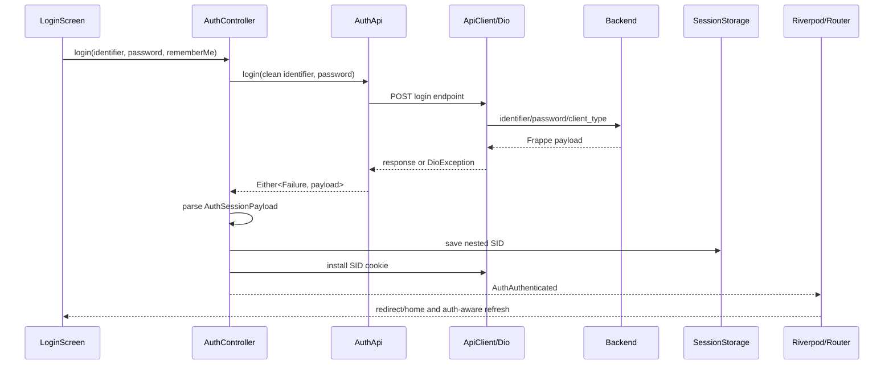

# Architecture

## Production components

### Presentation

- `LoginScreen` validates identifier and password, loads remembered login data, prevents duplicate UI submissions while busy, invokes password or social login, and navigates to the preserved redirect or home.
- `RegisterScreen` validates full name, email, password confirmation, and legal acceptance before registration. It then opens email verification.
- `VerifyOTPScreen` handles email verification and forgot-password OTP verification.
- `ForgotPasswordScreen` requests a reset OTP.
- `ResetPasswordScreen` submits the reset token and new password pair.
- `PasswordSecurityScreen` lives under Account and invokes authenticated password change.

### Application state

`authControllerProvider` is a `StateNotifierProvider<AuthController, AuthState>` and starts `AuthController.init()` immediately. The state model is deliberately small:

- `AuthLoading`
- `AuthGuest`
- `AuthAuthenticated`

`AuthAuthenticated` contains `AuthUser`, SID, preferences, roles, and `AuthSellerSummary`.

`isAuthenticatedProvider` derives a boolean from the concrete state type. It does not inspect SID directly.

### Data/API

`AuthApi` is the network boundary. It uses `ApiClient` and returns `Either<Failure, Map<String, dynamic>>`. Frappe response envelopes are removed by `unwrapFrappe`.

The current implementation has no repository abstraction between `AuthController` and `AuthApi`.

### Contract parsing

`MobileLoginRequest` owns the exact password-login request shape.

`AuthSessionPayload` defensively parses:

- nested session SID;
- optional `authenticated`;
- optional `expires_at` string;
- user;
- preferences;
- roles;
- seller snapshot.

The parser is shared by login completion and `/me` validation. `/me` remains valid without session fields when user data is present.

### Session transport

`ApiClient` uses:

- Dio JSON defaults;
- an in-memory `CookieJar`;
- `CookieManager` for outgoing cookies;
- `setSid()` to install an HTTP-only `sid` cookie;
- `clearSid()` to delete cookies;
- a broadcast `sessionExpiredStream` emitted for HTTP 401 responses.

The cookie jar itself is not persistent across process restarts. Secure storage is the persistent SID source; startup reinstalls the SID into the cookie jar before `/me`.

### Storage

`SessionStorage` stores:

- SID in `FlutterSecureStorage` under `aos_sid`;
- remember-me in SharedPreferences under `aos_remember_me`;
- remembered identifier in SharedPreferences under `aos_email`.

It exposes no password persistence method.

### Cross-feature effects

`AppRoot` listens to auth changes:

- authenticated: connects realtime using SID and email, initializes push notifications, loads notifications;
- guest: disconnects realtime and resets push notification state.

Other controllers, such as conversations, listen to `AuthState` and clear their own data on `AuthGuest`.

## Data-flow diagram



## Dependency direction

```text
features/auth/screens
  -> auth_controller_provider
  -> AuthController
  -> AuthApi
  -> ApiClient
  -> Dio, CookieJar, SessionStorage

AuthController
  -> user preference controller/API
  -> Failure mapping
  -> AuthSessionPayload

app_router
  -> app bootstrap state
  -> AuthState
  -> RouteGuards
```

## Test seams

- providers can override `authApiProvider`, `apiClientProvider`, and `sessionStorageProvider`;
- `AuthApi` methods are virtual and are replaced by `ScriptedAuthApi`;
- the shared recording Dio adapter verifies endpoint, method, headers, and body;
- `AuthController` accepts an optional clock function for deterministic refresh-cooldown tests;
- stable login widget keys identify identifier, password, remember-me, and submit controls.
