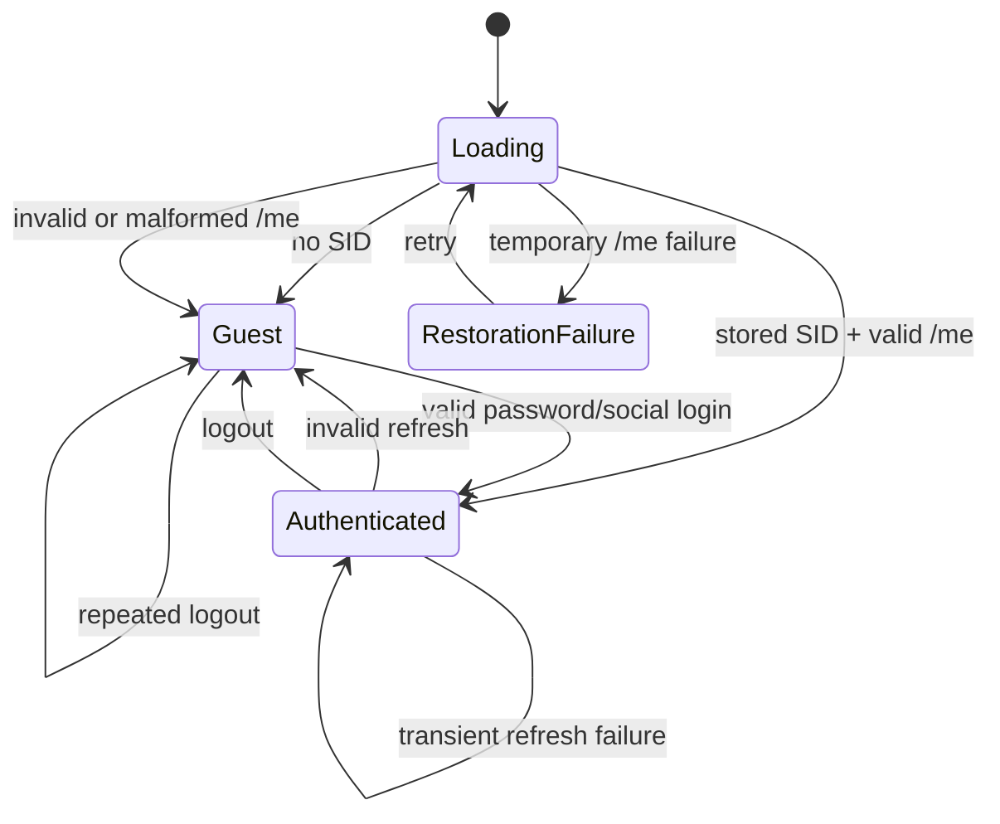

# Session Lifecycle

## Implemented state representation

The production feature does not use the separate `core/session/SessionState` enum-based model for active application authentication. Runtime routing and features use `AuthState`:

```text
AuthLoading
  -> AuthRestoring
  -> AuthRestorationFailure
  -> AuthGuest
  -> AuthAuthenticated
```

Transitions can return from `AuthAuthenticated` to `AuthGuest` through logout, invalid restoration, or failed expiry refresh.

`AuthLoading` represents controller initialization, not every login submission. Login-screen loading is local widget state.

## State machine



## Session evidence levels

1. **Stored SID exists**: restoration candidate only.
2. **SID installed in cookie jar**: transport configuration only.
3. **`/me` returns non-empty user data**: accepted restoration proof.
4. **`AuthAuthenticated` emitted**: frontend authenticated state.
5. **Roles and seller snapshot loaded**: frontend authorization context, not server permission proof.

## Login hydration

A login payload must satisfy all of the following:

- `ok == true`;
- `data.session.authenticated` is not explicitly false;
- nested `data.session.sid` is non-empty;
- `data.user` is non-empty.

Only then does `_completeLogin` install and persist SID and emit `AuthAuthenticated`.

`expires_at` is parsed as an optional string for contract visibility. The current controller does not schedule local expiry from it; backend rejection/HTTP 401 remains authoritative.

## Restoration outcomes

| `/me` outcome                                           | Local SID | Auth state                    |
| ------------------------------------------------------- | --------- | ----------------------------- |
| user present                                            | retained  | authenticated                 |
| 401/auth-required                                       | cleared   | guest                         |
| disabled/deleted/suspended                              | cleared   | guest                         |
| user missing/malformed without a stable invalidation ID | retained  | retryable restoration failure |
| network/transient failure                               | retained  | retryable restoration failure |

## Expiry refresh outcomes

| Refresh outcome       | Result                            |
| --------------------- | --------------------------------- |
| valid `/me`           | rehydrates authenticated state    |
| transient failure     | keeps current authenticated state |
| invalid/auth-required | clears session and becomes guest  |
| no stored SID         | clears session and becomes guest  |

## Cleanup ownership

`AuthController._clearSession` owns:

- secure SID deletion;
- cookie deletion;
- refresh/login in-flight reference reset;
- `AuthGuest` emission.

Cross-feature cleanup is decentralized. `AppRoot` handles realtime and push cleanup, while individual feature controllers are expected to listen to auth state and clear their own caches. There is no single global invalidation registry in the current implementation.
